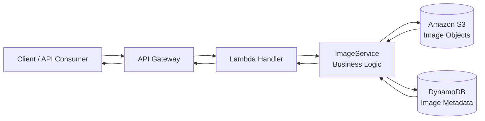

# Image Service

Serverless image management service built with Python, AWS Lambda, S3, and DynamoDB.

## Features

- Upload images with metadata (`tags`, `description`, optional dimensions)
- List images with filtering (`user_id`, `tags`) and pagination
- View or download images through presigned URLs
- Delete images and related metadata

## Architecture



### Layers

- `src/handlers/`: Lambda entry points and request/response mapping
- `src/services/`: business logic and orchestration
- `src/repositories/`: S3 and DynamoDB integrations
- `src/models/`: data and response models
- `src/common/`: shared config, validation, error, and logging utilities

## Project Structure

```text
image-service/
├── src/
│   ├── common/
│   ├── handlers/
│   ├── models/
│   ├── repositories/
│   └── services/
├── scripts/
│   └── deploy.sh
├── tests/
├── docker-compose.yml
├── requirements.txt
└── README.md
```

## API Summary

- `POST /images` - upload image
- `GET /images` - list images (`user_id`, `tags`, `limit`, `last_key`)
- `GET /images/{image_id}` - fetch image metadata + URL (`download`, `expires_in`)
- `DELETE /images/{image_id}` - delete image

### Validation Rules

- `limit` must be an integer in range `1..100`
- `expires_in` must be an integer in range `1..604800`
- `last_key` (if provided) must be a valid JSON object

## Prerequisites

- Python 3.12+
- Docker + Docker Compose
- `awslocal` CLI (LocalStack wrapper)
- `zip` utility

## Local Development

### 1) Install dependencies

```bash
pip install -r requirements.txt
```

### 2) Start LocalStack

```bash
docker-compose up -d
```

### 3) Deploy local infrastructure + Lambda

```bash
bash scripts/deploy.sh
```

This script is idempotent and safe to re-run:
- ensures bucket and table exist
- packages Lambda artifact
- creates or updates Lambda function
- creates or reuses API Gateway and deploys stage

## Configuration

Environment variables used by the service:

- `BUCKET_NAME` (default: `image-service-bucket`)
- `TABLE_NAME` (default: `image-metadata`)
- `AWS_DEFAULT_REGION` (default: `us-east-1`)
- `PRESIGNED_URL_EXPIRATION` (default: `3600`)
- `MAX_IMAGE_SIZE` (default: `10485760`)
- `USE_LOCALSTACK` (`1` for local development)

Environment variables used by deploy script:

- `FUNCTION_NAME` (default: `imageService`)
- `API_NAME` (default: `image-api`)
- `STAGE_NAME` (default: `dev`)
- `HANDLER_NAME` (default: `src.handlers.image_handler.lambda_handler`)
- `LAMBDA_RUNTIME` (default: `python3.12`)

## Testing

Preferred (project-integrated):

```bash
python -m pytest tests -v
```

Current baseline: `18` tests passing.

## Operational Notes

- Structured JSON logging is enabled for handler and service flows.
- Upload flow includes metadata-write rollback (deletes S3 object if metadata save fails).
- Presigned URL generation failures now return explicit service errors (no silent fallback URL).
